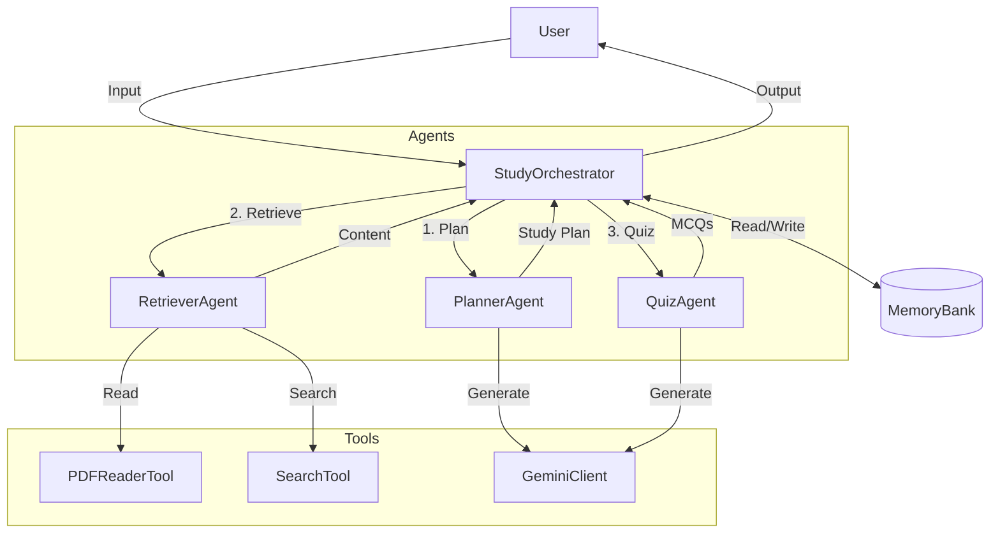

# StudyGuardian

An AI-powered study companion built for the Google AI Agent Capstone.

## Features
- **Study Planning**: Automatically generates a study plan based on your goals.
- **Resource Retrieval**: Finds relevant content from the web or your uploaded PDFs.
- **Quiz Generation**: Creates quizzes to test your knowledge.
- **Progress Tracking**: Remembers your study history.

## Architecture



## Project Structure
- `app/main.py`: Entry point.
- `app/orchestrator.py`: Manages the agent workflow.
- `app/agents/`: Contains the individual agents (Planner, Retriever, Quiz).
- `app/tools/`: Contains tools for PDF reading and Search.

## Setup

1.  **Clone the repository**.
2.  **Install dependencies**:
    ```bash
    pip install -r requirements.txt
    ```
3.  **Configure Environment**:
    Create a `.env` file in the root directory and add your Google API Key:
    ```
    GOOGLE_API_KEY=your_api_key_here
    ```
4.  **Run the Application**:
    ```bash
    python app/main.py
    ```

## Architecture
- `app/main.py`: Entry point.
- `app/orchestrator.py`: Manages the agent workflow.
- `app/agents/`: Contains the individual agents (Planner, Retriever, Quiz).
- `app/tools/`: Contains tools for PDF reading and Search.